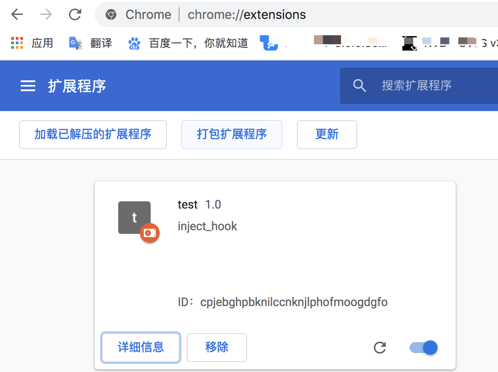

# 写在前面
在安全测试过程中，经常会发现存在数据加密的问题，增加测试门槛，常见加密如rsa+aes加密/aes直接加密，如遇到以下平安加密网址

# 信息调研
通过前端调试可以发现，该h5使用了aes加密参数，rsa加密aes密钥的方式进行传输，并且为了对加解密做管控，加了全局对象来存储加解密方式，同时方便打开或关闭加解密开关。
而我们的目的是为了能够进行安全测试，对参数进行改动和发包测试，即解密ecBizDatas参数，即解密aes，解密aes需要知道加密模式及aes密钥，这些通过前端断点调试都可获取。
随后直接使用bp插件，把aes的参数填写进去即可实现解密，但通过调试发现aes密钥是动态生成的，在解密过程中就需要每次获取这个随机密钥进行解密，于是写个chrome插件来固定aes生成的密钥，前端调试分析过程见下

# 实现效果
chrome_ext/js/hook.js#93-#109为hook住前端window.security.randomString代码，使返回固定值如16个1

bp插件实现解密，使用通用解密插件填入aes相关信息

# 谷歌插件的作用
Chrome Extension提供了许多的API可供我们使用，通过对这些API的使用，我们可以做到：
控制书签、控制下载、控制窗口、控制标签、控制网络请求、监听各类事件、自定义原生菜单、完善的通信机制等等
# 内部文件组成
##manifest.json
是必须的描述文件,用以申请一些权限、配置一些基础信息，包括图标,行为等。
文件中的以下字段是必填的：
manifest_version，清单文件的版本，固定为2即可
name，插件的名称
version，插件的版本

## background.js
后台脚本是扩展的事件处理程序;它包含对扩展很重要的浏览器事件的监听器。它处于休眠状态，直到触发一个事件，然后执行指示的逻辑。有效的后台脚本只在需要时加载，在空闲时卸载。 区别在于manifest.json中persistent属性值的不同
没有可见页面,只是一个执行后台脚本的一个页面
ps：此处没有使用

## img
为插件图标，可设置多个不同规格的图标

## js
真正hook的脚本，直接调用他人写好的[通用hookjs](https://github.com/pnigos/hookjs)的一个脚本来使用，调用也写在该hook.js下，修改54行的返回值

## script.js
描述需要直接注入页面的js和css

